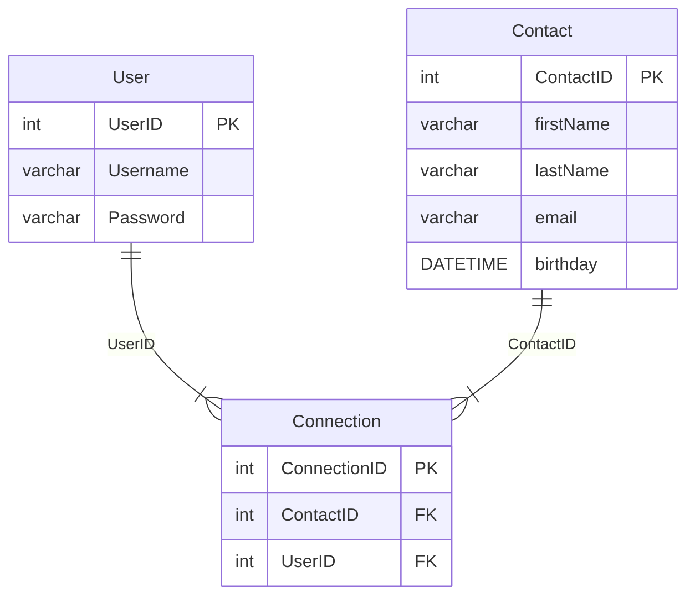

# ERD + SQL Setup


## Create Database
```sql
CREATE DATABASE contactManager;
```

## Create Tables
```sql
CREATE TABLE Users (
    UserID int NOT NULL AUTO_INCREMENT,
    Username varchar(255),
    Password varchar(255),
    PRIMARY KEY (UserID)
);

CREATE TABLE Contacts (
    ContactID int NOT NULL AUTO_INCREMENT,
    firstName varchar(255),
    lastName varchar(255),
    email varchar(255),
    birthday DATE,
    PRIMARY KEY (ContactID)
);

CREATE TABLE Connections (
    ConnectionID int NOT NULL AUTO_INCREMENT,
    UserID int,
    ContactID int,
    PRIMARY KEY (ConnectionID),
    FOREIGN KEY (ContactID) REFERENCES Contacts(ContactID),
    FOREIGN KEY (UserID) REFERENCES Users(UserID)
);
```

## Insert Test Data
```sql
INSERT INTO Users (Username, password)
VALUES
('KyleM', '1234'),
('Joanne', '1234'),
('Justin', '1234'),
('Collin', '1234'),
('Tiffany', '1234'),
('Jason', '1234');

INSERT INTO Contacts (firstName, lastName, email, birthday)
VALUES
('Dawn', 'McGuffin', 'kane1977@gmail.com', '1967-7-15'),
('Jasper', 'Schnwager', 'jarret.turn@hotmail.com', '1968-7-15'),
('Jose', 'Padgett', 'elisabeth_polli@gmail.com', '1970-7-15'),
('John', 'Buzzard', 'kane1977@gmail.com', '1971-7-15'),
('Linda', 'Marshall', 'major_kub1994@yahoo.com', '1972-7-15'),
('Henry', 'Johnson', 'timothy1979@hotmail.com', '1973-7-15');

INSERT INTO Connections (UserId, ContactId)
VALUES
(1,2), /* Kyle --> Jasper */
(2,1), /* Joanne --> Dawn */
(3,4), /* Justin --> John */
(5,6); /* Tiffany --> Henry */
```

## Base Queries
```sql
SELECT * FROM Users;
SELECT * FROM Connections;
SELECT * FROM Contacts;
```

```sql
SELECT * FROM Connections
LEFT JOIN Contacts
ON Contacts.ContactID = Connections.ContactID
LEFT JOIN Users
ON Users.UserID = Connections.UserID;
```


```sql
SELECT Users.username as Username, CONCAT(Contacts.firstName, ' ', Contacts.lastName) as Knows FROM Connections
LEFT JOIN Contacts
ON Contacts.ContactID = Connections.ContactID
LEFT JOIN Users
ON Users.UserID = Connections.UserID;
```

